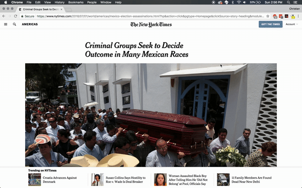
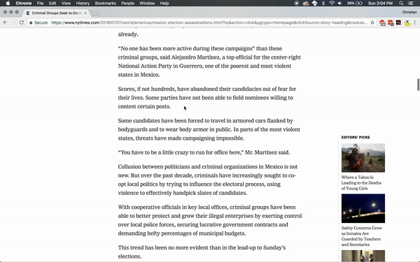
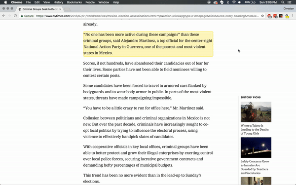
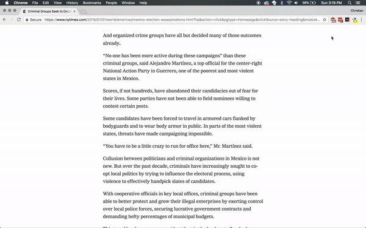
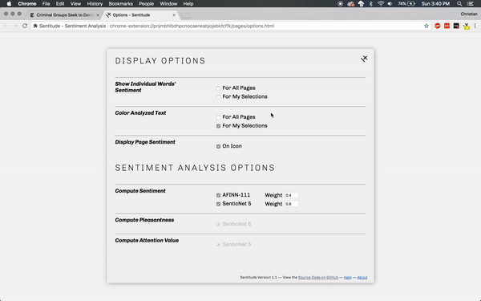
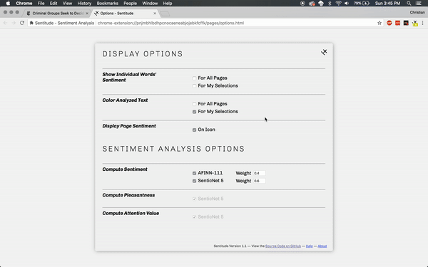

# Help 

## Using Sentitude

### Analyzing Pages

By default, Sentitude analyzes all pages you visit. To see the score of a page, click the Sentitude icon in the Chrome menu bar to open the popup menu. The page's value is also displayed in the badge on the Sentitude icon.

### Analyzing Text

There are a number of ways to analyze a single section of text. To begin, select the text you want to analyze. There are two ways to get its sentiment. 

You can right click and select `Get sentiment of selection` from the menu, or you can press `Command+Shift+A` for Mac and `Control+Shift+A` for Windows and others. 

The sentiment value will by default appear on the text you selected. If not, it can always be found in the popup menu. 

If you'd like to select more than one paragraph at once, *do not* highlight the text. Instead, open the popup menu and choose `Select Paragraphs`. Now, you can click on any paragraphs on the page to get their sentiment values.  

## Settings

### Display Options 

The `Show Individual Words' Sentiments` setting allows you to toggle the display of individual words' sentiment values. With this setting enabled, each recognized word in a selection or page is highlighted in a color that represents its sentiment value. Hovering over each word displays more information about its sentiment. 

The `Color Analyzed Text` setting allows you to toggle the display of a selection or page's sentiment value and color representation. With this setting enabled, a highlight color is placed around the selection and hovering over it displays more information about its sentiment. With this setting disabled, your pages and selections are not changed visually, but their sentiment values can still be found in the popup window. 

The `Display Page Sentiment` setting allows you to toggle the display of the page's sentiment on the Sentitude icon in the toolbar. Disabling this option removes the sentiment value from the icon. 

### Sentiment Analysis Options 

In this section, you can edit which dictionaries are used to calculate the sentiment for your pages and selections. You can disable one or the other and change the weights of each. It is not recommended that you change these settings much, as they are set optimally by default. 